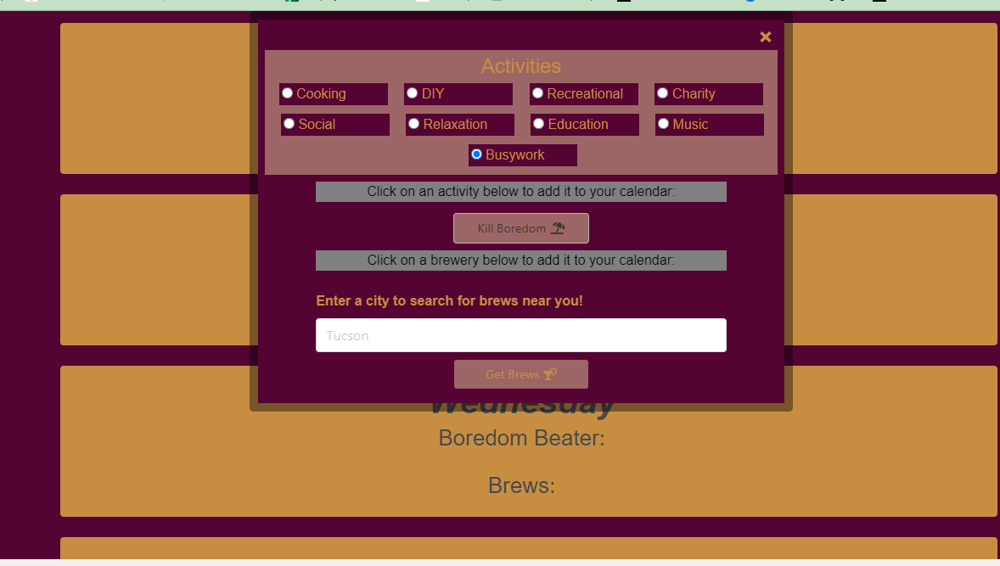

# Bored and Brews

# Description

# Table of Contents
- [Built With](#built-with)
- [Code Access](#code-access)
- [Preview](#preview)
- [Functionality](#functionality)
- [Bored and Brews  Link](#bored-and-brews-link)
- [Contribution](#contribution)
- [Credit](#credit)

# Built With
- HTML
- CSS
- Bulma
- JavaScript
- Bored API
- Open Brewery DB API

# Code Access
If you would like to access the code for this project, please visit this [GitHub](https://github.com/fmatthew40/bored-and-brews/) repository.

# Preview
Below are several screenshots of the Bored and Brews Application:

# Functionality

# Bored and Brews Link
The link to the Bored and Brews application is provided below:
https://fmatthew40.github.io/bored-and-brews/

# Contribution
The creation of Bored and Brews was made possible by the contributions of Matthew Foster, Yin Qin, Sammi Moore, and Elle Knapp.
Below is a breakdown of each person's role and contribution for this project:

Matthew Foster:

Yin Qin:

Sammi Moore:

Elle Knapp: javascript, localstorage, html layout, css styling

# Credit